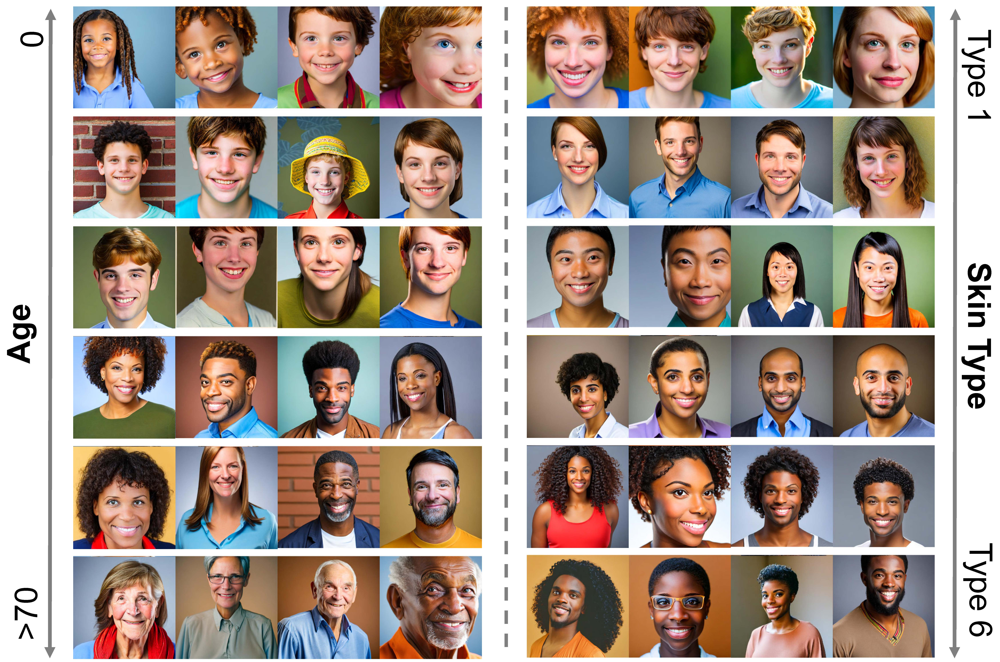

# Bimodal Debiasing for Text-to-Image Diffusion: Adaptive Guidance in Textual and Visual Spaces

Official Implementation of the **Bimodal Debiasing for Text-to-Image Diffusion: Adaptive Guidance in Textual and Visual Spaces**. 



> Social biases in diffusion-based text-to-image models have drawn increasing attention. Yet, existing debiasing efforts often focus solely on either the **textual** space (e.g., CLIP) or the **visual** space (e.g., U-Net). This **unimodal perspective** introduces two major challenges:
>
> 1. **Debiasing only the textual space** fails to control visual outputs, often leading to *pseudo-* or *over-corrections* due to unaddressed visual biases during denoising.
> 2. **Debiasing only the visual space** can cause *modality conflicts* when biases in textual and visual modalities are misaligned, degrading the quality and consistency of the generated images.
>
> To address these issues, we propose **BADGE** (*Bimodal ADaptive Guidance DEbiasing* within Textual and Visual Spaces). BADGE consists of two key components:
>
> - It first **quantifies attribute-level bias inclination** in both modalities, providing precise guidance for subsequent mitigation.
> - Then, to avoid pseudo- or over-correction and modality conflicts, the **quantified bias degree** is used as the **debiasing strength** for adaptive guidance, enabling fine-grained correction tailored to discrete attribute concepts.
>
> BADGE is a **self-debiasing** method that requires **no additional training** or external corpora.
>
> Extensive experiments demonstrate that BADGE significantly enhances **fairness** across intra- and inter-category attributes (e.g., gender, skin tone, age, and their interaction) while preserving **high image fidelity**.

## Installation

```bash
pip install -r requirements.txt
```

## Usage

### A Simple Example for Debiasing Text-to-Image Models.
The code aims to remove the gender bias of [Stable Diffusion v2.1](https://huggingface.co/stabilityai/stable-diffusion-2-1).

Flags:
  - `--cls`: select the target class, e.g., doctor.
  - `--lam`: hyperparameter lambda of debiasing algorithm


For instance, to reproduce the experiments, run
```bash
cd generative
python main.py --cls doctor --lam 500
```

### Semantic Guidance (Using SD v1.5 as an example)
```python
from diffusers import SemanticStableDiffusionPipeline
device = 'cuda'
pipe = SemanticStableDiffusionPipeline.from_pretrained(
    "runwayml/stable-diffusion-v1-5",
).to(device)
import torch
gen = torch.Generator(device=device)

gen.manual_seed(21)
out = pipe(prompt='a photo of the face of a woman', generator=gen, num_images_per_prompt=1, guidance_scale=7,
           editing_prompt=['smiling, smile',       # Concepts to apply 
                           'glasses, wearing glasses', 
                           'curls, wavy hair, curly hair', 
                           'beard, full beard, mustache'],
           reverse_editing_direction=[False, False, False, False], # Direction of guidance i.e. increase all concepts
           edit_warmup_steps=[10, 10, 10,10], # Warmup period for each concept
           edit_guidance_scale=[4, 5, 5, 5.4], # Guidance scale for each concept
           edit_threshold=[0.99, 0.975, 0.925, 0.96], # Threshold for each concept. Threshold equals the percentile of the latent space that will be discarded. I.e. threshold=0.99 uses 1% of the latent dimensions
           edit_momentum_scale=0.3, # Momentum scale that will be added to the latent guidance
           edit_mom_beta=0.6, # Momentum beta
           edit_weights=[1,1,1,1,1] # Weights of the individual concepts against each other
          )
images = out.images
```

### Debiasing Zero-Shot Models.

Flags:
  - `--dataset`: select the dataset (waterbirds/celebA)
  - `--load_base_model`: select backbone model (clip_RN50/clip_ViTL14)
  - `--debias`: debias the text embedding or not
  - `--lam`: hyperparameter lambda of debiasing algorithm


For instance, to reproduce the experiments, run
```bash
cd discriminative
python main.py --dataset waterbirds --load_base_model clip_RN50 --debias
```

